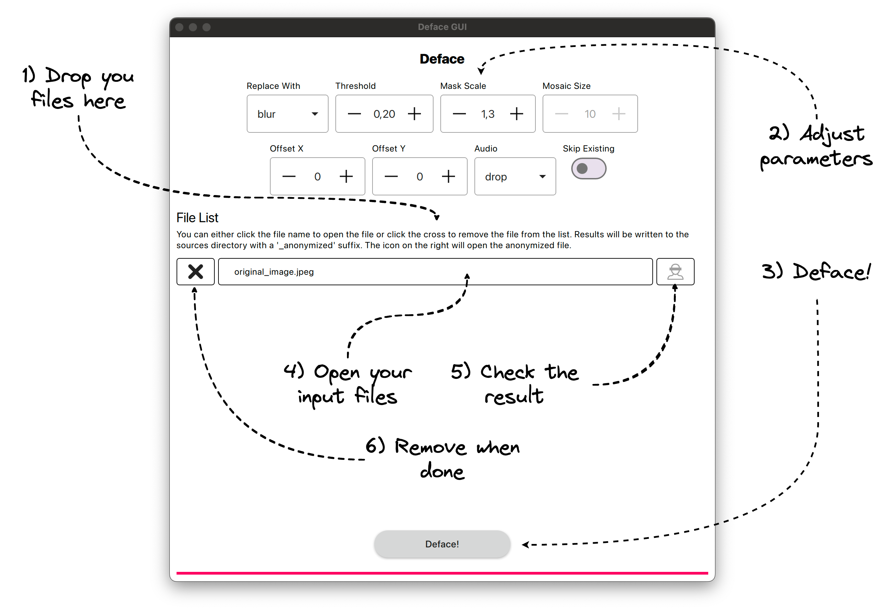

# `deface`: Image and video anonymization by face detection and audio distortion

This is a fork of the cli program [deface](https://github.com/ORB-HD/deface). The cli interface has been slightly extended but works mostly like the original. It features a QT gui with batch processing features.

## Installation

Download the application for your operating system from the [release page](https://github.com/caretech-owl/deface/releases).

### From Source

Alternatively, you can clone the project and run either the gui or cli directly.

```bash
# # clone the source code and enter the project folder
git clone git@github.com:caretech-owl/deface.git
cd deface
# # create and load your Python environment via conda, mamba, venv, etc...
# conda create -n deface && conda activate deface
# python -m venv venv/deface && . venv/deface/bin/activate
# ...
# # install deface editable which includes all dependencies
pip install -e .
# # run the gui application
python deface/gui.py
# # ... or the cli
python deface/cli.py
```

## Usage



## Demo

https://github.com/user-attachments/assets/159894d8-c7d0-47e2-82d3-82c375e3a538

### Cli

```
usage: cli.py [--output O] [--thresh T] [--scale WxH] [--preview] [--boxes] [--draw-scores] [--mask-scale M]
              [--replacewith {blur,solid,none,img,mosaic}] [--replaceimg REPLACEIMG] [--mosaicsize width] [--audio {drop,copy,distort}]
              [--ffmpeg-config FFMPEG_CONFIG] [--backend {auto,onnxrt,opencv}] [--execution-provider EP] [--version] [--keep-metadata]
              [--offset-x X] [--offset-y Y] [--help]
              [input ...]

Image and video anonymization by face detection and audio distortion

positional arguments:
  input                 File path(s) or camera device name. It is possible to pass multiple paths by separating them by spaces or by using shell
                        expansion (e.g. `$ deface vids/*.mp4`). Alternatively, you can pass a directory as an input, in which case all files in
                        the directory will be used as inputs. If a camera is installed, a live webcam demo can be started by running `$ deface
                        cam` (which is a shortcut for `$ deface -p '<video0>'`.

options:
  --output O, -o O      Output file name. Defaults to input path + postfix "_anonymized".
  --thresh T, -t T      Detection threshold (tune this to trade off between false positive and false negative rate). Default: 0.2.
  --scale WxH, -s WxH   Downscale images for network inference to this size (format: WxH, example: --scale 640x360).
  --preview, -p         Enable live preview GUI (can decrease performance).
  --boxes               Use boxes instead of ellipse masks.
  --draw-scores         Draw detection scores onto outputs.
  --mask-scale M        Scale factor for face masks, to make sure that masks cover the complete face. Default: 1.3.
  --replacewith {blur,solid,none,img,mosaic}
                        Anonymization filter mode for face regions. "blur" applies a strong gaussian blurring, "solid" draws a solid black box,
                        "none" does leaves the input unchanged, "img" replaces the face with a custom image and "mosaic" replaces the face with
                        mosaic. Default: "blur".
  --replaceimg REPLACEIMG
                        Anonymization image for face regions. Requires --replacewith img option.
  --mosaicsize width    Setting the mosaic size. Requires --replacewith mosaic option. Default: 20.
  --audio {drop,copy,distort}, -a {drop,copy,distort}
                        Drop source's audio, copy or distort it.
  --ffmpeg-config FFMPEG_CONFIG
                        FFMPEG config arguments for encoding output videos. This argument is expected in JSON notation. For a list of possible
                        options, refer to the ffmpeg-imageio docs. Default: '{"codec": "libx264"}'.
  --backend {auto,onnxrt,opencv}
                        Backend for ONNX model execution. Default: "auto" (prefer onnxrt if available).
  --execution-provider EP, --ep EP
                        Override onnxrt execution provider (see https://onnxruntime.ai/docs/execution-providers/). If not specified, the
                        presumably fastest available one will be automatically selected. Only used if backend is onnxrt.
  --version             Print version number and exit.
  --keep-metadata, -m   Keep metadata of the original image. Default : False.
  --offset-x X, -x X
  --offset-y Y, -y Y
  --help, -h            Show this help message and exit.
```
